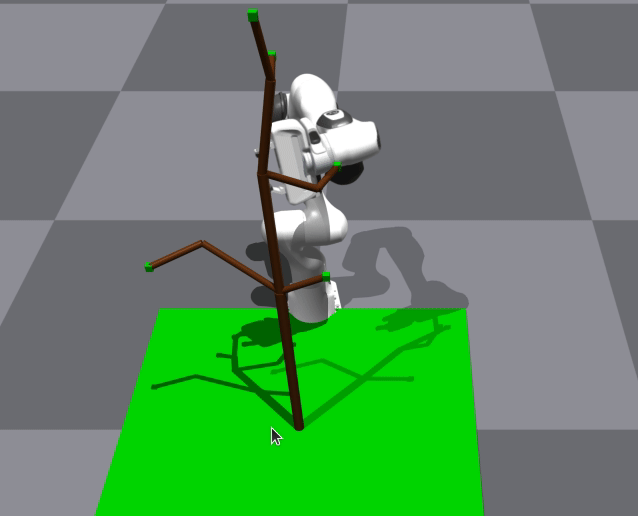

# 16745 OCRL Project: RRT planning for Agriculture Manipulation

Chia-Chun Hsieh, Yi-Hung Chiu, Mark Lee



## Relevant files
This repo extends [CMU IAMLAB's isaacgym-utils](https://github.com/iamlab-cmu/isaacgym-utils) for our project. Here are our modifications:

1. Tree Generation: Please refer to [TREEGEN.md](TREEGEN.md) for details on how to run
    * [scripts/generate_tree_files.py] (scripts/generate_tree_files.py) to generate the collision boxes `npy` and tree `urdf` representation used by the planning algorithm and simulation respectively
    * [scripts/SCA_tree_gen.py](scripts/SCA_tree_gen.py) generates tree and collision box constraints for RRT. See [this method](https://github.com/jeffersonHsieh/isaacgym-utils/blob/372acfbeea82ddc4f7b7c5611a40f682695c6ef0/scripts/SCA_tree_gen.py#L311) for details
    * [examples/franka_tree_visualize_ocrl.py](examples/franka_tree_visualize_ocrl.py) to render tree in simulation and render npy representations in matplotlib
    * `cfg/franka_tree_force_ocrl.yaml`: generated tree config
    * `assets/franka_description/robots/[10]tree0_ocrl.urdf` and `assets/franka_description/robots/tree0_box_link.npy` are generated tree files

2. RRT Planning
    * [RRT Class](https://github.com/jeffersonHsieh/isaacgym-utils/blob/372acfbeea82ddc4f7b7c5611a40f682695c6ef0/isaacgym_utils/rrt.py#L29): RRT planner modified from [here](https://github.com/aaronzguan/Franka-Robot-Path-Planning/blob/master/Path%20Planning/rrt.py). Changed to use `GymFranka`'s [check collision method](https://github.com/jeffersonHsieh/isaacgym-utils/blob/372acfbeea82ddc4f7b7c5611a40f682695c6ef0/isaacgym_utils/assets/franka.py#L544)

    * [Planner Class](https://github.com/jeffersonHsieh/isaacgym-utils/blob/372acfbeea82ddc4f7b7c5611a40f682695c6ef0/isaacgym_utils/policy.py#L105): wrapper class to execute RRT planner and display path (by setting joint states at each timestep) in isaacgym simulation

    * [examples/franka_tree_ocrl.py](examples/franka_tree_ocrl.py): planner entry point to generate planned paths and save to `npy` files

3. PD Control

    * [PD Controller Class](https://github.com/jeffersonHsieh/isaacgym-utils/blob/372acfbeea82ddc4f7b7c5611a40f682695c6ef0/isaacgym_utils/policy.py#L511): PD controller
    * [Trajectory Tracking Class](https://github.com/jeffersonHsieh/isaacgym-utils/blob/372acfbeea82ddc4f7b7c5611a40f682695c6ef0/isaacgym_utils/policy.py#L536): used in simulation to apply control to robot arms based on PD controller.
    * [examples/franka_tree_control_exp.py](examples/franka_tree_control_exp.py): entry point for control experiments. Must be run from the `examples` folder
    * [examples/run_exp.sh](examples/run_exp.sh): PD gains tuning experiments
    * [examples/run_init_exp.sh](examples/run_init_exp.sh): shell script for running trajectory tracking on planned RRT trajectories with tuned PD gains.
    * [exp/breakup_trajs.py](exp/breakup_trajs.py): breaks up planned trajectories `npy` into individual files
    * [exp/plot_pd_exp_results.py](exp/plot_pd_exp_results.py) generates line charts for PD gain tuning from run logs.


## isaacgym-utils
This repo contains wrappers and utilities for `isaacgym`

Supported version of Isaac Gym: 1.0rc2

Supported `up_axis` mode: `z` (`UP_AXIS_Z` in the Isaac Gym documentation)

## Installation

### Install IsaacGym

Please refer to [this link](https://github.com/MarkLee634/OCRL_project_treemanipulate/tree/main/isaacgym) for a cloned version of the library.

Or install IsaacGym from [Nvidia](https://developer.nvidia.com/isaac-gym)

This library supports the latest IsaacGym version - `1.0.preview2`.
It will not work with older versions.


### Install isaacgym-utils

Install `isaacgym-utils`:

clone this repo, then
```bash
pip install -e isaacgym-utils
```

please refer to [INSTALLATION_MORE.md](INSTALLATION_MORE.md) for more details (irrelevant to our project.)


## Running examples

Examples scripts can be found in `isaacgym-utils/examples/`.
These scripts need to be run at the root level of `isaacgym-utils`:

```bash
cd isaacgym-utils
python examples/run_franka.py
```

Each example script has a corresponding config file in `cfg/` that can be used to change object properties like friction.


## Citation

If you use `isaacgym-utils` in a publication, please consider citing the repo:

```
@misc{isaacgym-utils,
title = {IsaacGym Utilities},
year = {2021},
note = {Developed by the CMU Intelligent Autonomous Manipulation Lab},
url={https://github.com/iamlab-cmu/isaacgym-utils},
author = {Liang, Jacky},
}
```
