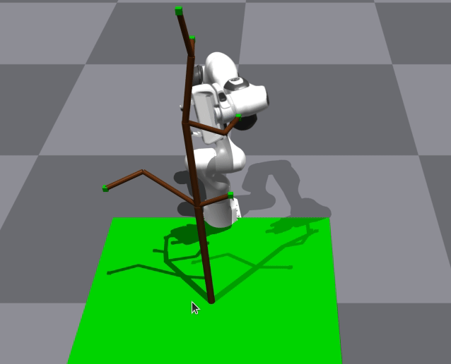

# Running script to generate tree
This script creates the tree and visualizes in IsaacGym sim 
```
# relative to the isaacgym-utils base directory
cd scripts/
python generate_tree_files.py 
```


# Running example code to move robot to tree
comment out line 339 (in the while True loop) for visualize_box_collision_for_tree() function

```
# from base directory
cd examples/
python franka_tree_visualize_ocrl.py 
```


# Visualizing the tree box shapes
comment line 339 (in the while True loop) for visualize_box_collision_for_tree() function
```
cd /home/mark/course/16745_orcl/OCRL_project_treemanipulate/isaacgym-utils-ocrl/examples
python franka_tree_visualize_ocrl.py 
```


